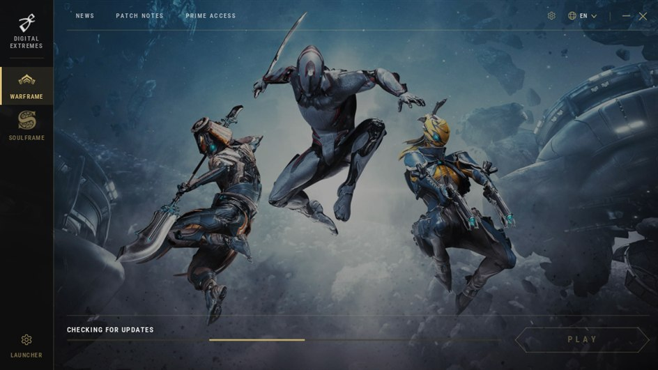
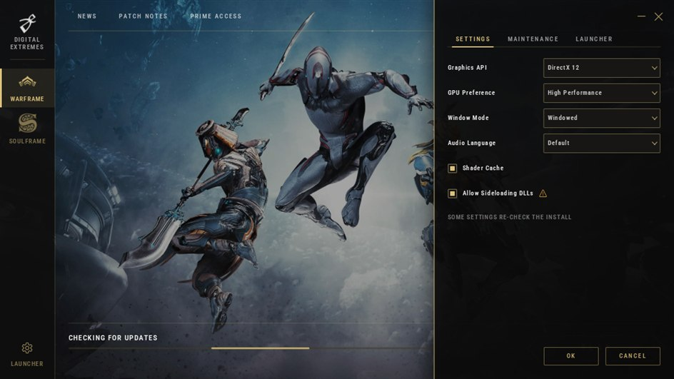

<div align="center">

# Evolution Launcher

A custom launcher for Warframe and Soulframe.

<a href="https://en.cppreference.com/w/cpp/26"></a>


<a href="LICENSE.txt"></a>
<a href="https://github.com/leonardovac/EvolutionLauncher/stargazers"></a>



</div>

Has all the capabilities of the original and works as a complete replacement for it.
The protocol is written up in [docs/protocol.md](docs/protocol.md).

> [!WARNING]
> Do **NOT** replace the original `Tools\Launcher.exe` in the game folder with this. The first thing it would do is restore the original.

## Why

The original launcher purges unlisted files. It walks the install and deletes anything it does not recognise, so a ReShade DLL or a mod sitting beside the game's executable is gone after the next launch/update.

This one purges only inside directories the index itself populates, and leaves the root and anything beside the executable alone.
A `protect` list covers whatever else you want kept, and an `exclude` list covers content you would rather skip.
Both live in `launcher.json` beside the executable.

Downloads run in parallel.

## Installing

Put `Launcher.exe` anywhere you like — a folder of its own is fine. It finds the game on its own, so it does not need to live inside the install.

> [!CAUTION]
> Anywhere except `<install>\Tools\`. The index lists `/Tools/Launcher.exe`, so a copy sitting there overwrites itself with the retail launcher on the next run.

`launcher.json` is written beside the executable on first save, so keep the folder writable.

## Building

MSVC, built with `/std:c++latest`. Run `build.bat` from a developer prompt, or `build.bat debug`. Output is `bin\Launcher.exe`.
There is no solution file and no CMake.

Nothing to fetch first: the LZMA decoder is vendored under `third_party\lzma`.

## Running

With no arguments it opens the window. Everything else is a command-line run:

    Launcher.exe --check                 plan the work, download nothing
    Launcher.exe --verify                hash the caches too, not just check they exist
    Launcher.exe --stale                 list files the index does not name
    Launcher.exe --purge-print           preview what a real run would delete
    Launcher.exe --jobs 8                more parallel downloads
    Launcher.exe --title soulframe
    Launcher.exe --help

Exit codes are `0` ok, `1` failed, `2` cancelled, `3` work to do (`--check` only).

The install root comes from `HKCU\Software\Digital Extremes\<title>\Launcher\LauncherExe`, so an Epic/Steam install is found where the platform actually put it. Override it with `--root`.

## Settings

<div align="center">

</div>

Graphics API, GPU preference, window mode, language and the shader cache are the game's own settings and go back to the registry the game reads them from. Everything only this launcher acts on lives in `launcher.json`.

### `launcher.json`

```json
{
  "exclude": [
    "Tools\\Windows\\x64\\discord_game_sdk.dll"
  ],
  "protect": [
    "*\\reshade-shaders\\*",
    "Tools\\my-overlay.dll"
  ],
  "allowNetworkCaches": true,
  "sideload": { "warframe": true }
}
```

`exclude` is never fetched, and removed if found — declining a file and leaving a copy behind would be contradictory. `protect` is never removed. A path on both lists is protected.

`protect` entries are globs: `*` spans separators, `?` takes one character. `exclude` entries are literal paths.

Write separators however you like — `Tools\x.dll`, `Tools\\x.dll` and `Tools/x.dll` all mean the same thing. Only `\"` and `\\` unescape, because every string in this file is a Windows path.

`patched`, `lastTitle` and `sideload` are written by the launcher; you can edit them, but you do not have to.

## Notes

Bytes land in a `.tmp`, get hashed, and are only then moved. A mismatch throws the file away, so interrupting a run leaves the install consistent.

Large uncompressed entries are split into ranged chunks fetched at once.
Cancelling one of those keeps the partial file and a small `.ranges` file beside it, so the next run picks up where it stopped.

Cache files are checked for existence unless you pass `--verify`, because hashing a full cache is tens of gigabytes of reads.
Defragmenting rewrites the cache in place, so its bytes stop matching the index; a hashed cache that differs is reported and left alone.

The game's executable is patched so the loader searches its own folder for DLLs, which is what lets a sideloaded DLL work at all. That changes the file's hash, so the before and after are recorded in `launcher.json` and the file is not re-downloaded for it. Turn it off per title in the Settings tab; the next check then re-fetches a clean copy.

## Thanks

Digital Extremes, for producing both games.

Igor Pavlov, for LZMA and the SDK around it.

## License

The source is MIT, see [LICENSE.txt](LICENSE.txt).

That covers the code and nothing else. The artwork under `assets/` belongs to Digital Extremes, the font is Roboto Condensed under the SIL Open Font License, and `third_party/lzma` is public domain. [NOTICE.txt](NOTICE.txt) names each one.

## Disclaimer

Not affiliated with, endorsed by, or connected to Digital Extremes. Warframe, Soulframe, and the artwork under `assets/` are their property, used here only to point the launcher at their own games.
